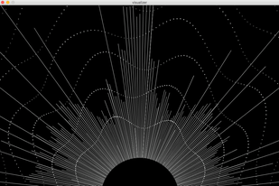
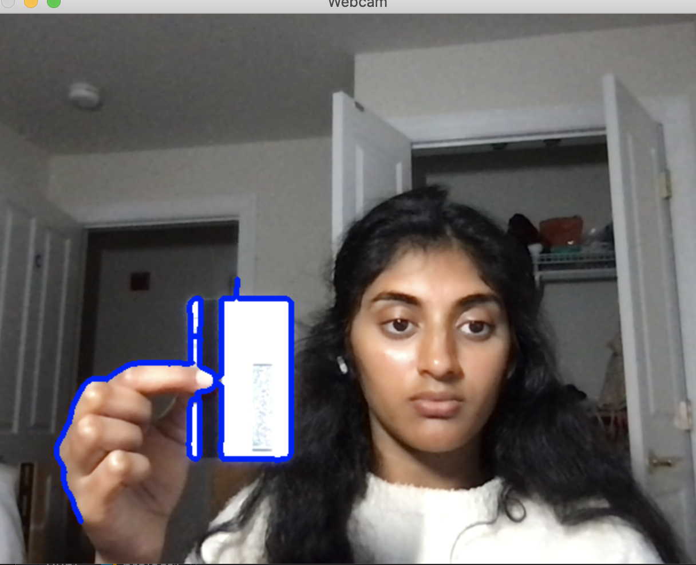
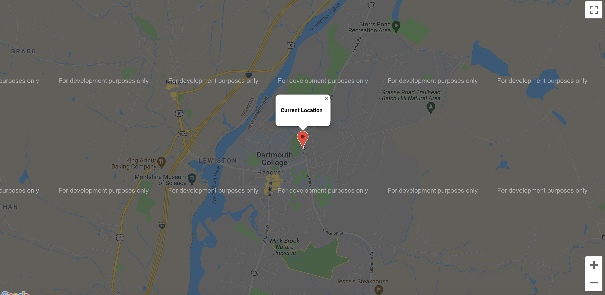

# Hack-a-thing 2

## What you built? 

1) Music visualizer

Although this is not directly relevant to the project that I pitched, several other teams pitched music-related apps, which sparked my interest in music visualization as I was looking for cool tutorials. To follow this tutorial, I used `Processing`, which is a graphical library based on Java and `Minim`, a sound analysis library. I inputted a sample song and tested the visualization. Below is a screenshot from the visualization.

2) OpenCV Document scanner

During the "Share a Paper" activity in class, several people mentioned the OpenCV library, which I thought would be a cool thing to look into for my hack-a-thing. More related to the project that I pitched, I looked into applications like image processing and document scanning. This is more relevant to my pitch as people will likely have numerous documents to upload/scan in order to process their unemployment claims. Below is a screenshot from my progerss on the tutorial:

3) Google Maps API

For this assignment, I created small React Application to test including the Google Maps API. I followed the tutorial to find my current location and place a pin it with a label. This could also be useful for the app that we pitched, as workers from different areas face different state and local regulations, so getting an accurate sense of their location would be helpful.

## Who Did What?

I worked alone.

## What you learned

1) Music visualizer

Overall, I was amazed by how reasonably straightforward it was to follow the tutorial to implement this music visualization. Something that stood out to me, however, was there were a lot of already calculated numbers to generate the precise design. The article didn't go into detail about how it got these numbers, so I think this could be another interesting thing to look into. Because there were a lot of numbers that I didn't understand where they came from, it was a little difficult to get into the details of the visualization, but it was interesting overall!

2) OpenCV Document scanner

I attempted to implement a full document scanner as laid out in the tutorials. I need to further develop my experience/proficiency in Python so I did not fully debug some of the Python specific issues; as such, I could not fully implement the document scanner. However, I did a learn a lot about OpenCV; overall the main point of doing the tutorial was to demystify OpenCV, which I accomplished. 

3) Google Maps

I got the idea of following a tutorial on integrating Google Maps after a classmate mentioned that he had done the same. Overall, I think this was fairly successful and the most intuitive to me. I am familiar with React and have used several external APIs before, so I was able to understand/follow this tutorial much more easily than I was able to follow the other ones. 

## Authors

Sanjana Goli (I worked alone)

## Acknowledgments

Maps:
https://www.digitalocean.com/community/tutorials/how-to-integrate-the-google-maps-api-into-react-applications

Music Visualizer:
https://www.generativehut.com/post/using-processing-for-music-visualization

OpenCV:
https://www.youtube.com/watch?v=WQeoO7MI0Bs
